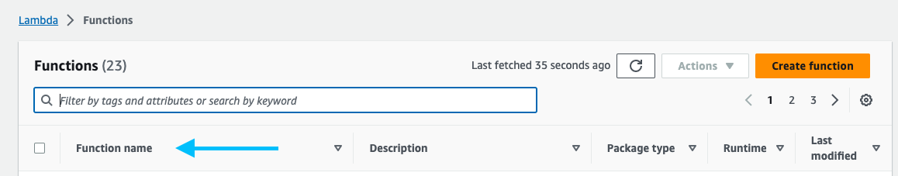

# Ingest

This component is a system which fetches existing documents from the [Ocean Best Practices respository](https://repository.oceanbestpractices.org/), extracts text if necessary, and indexes the document metadata into OpenSearch. The ingest component is also responsible for managing supported ontologies and vocabularies in a managed Neptune instance.

## Table of Contents

1. Prerequisites
2. Ingesting Documents
3. Bulk Ingesting Documents
4. Deleting Documents
5. Updating Documents

## Prerequisites

While you can do everything you need to do in order to deploy via the AWS console, this documentation is written as though you're deploying via the [AWS CLI](https://docs.aws.amazon.com/cli/latest/userguide/cli-chap-install.html).

You will need to have an AWS profile configured locally in order to interact with the CLI:<br>
<sub><sup>_This assumes you are using an admin role within the account and do not yet have a user account._</sup></sub>

1. Create/Acquire a user and get the appropriate credentials
2. There are two ways to add a profile into the AWS CLI
    1. By adding the user to `.aws/credentials` and `.aws/config`
        - This can be achieved by opening them up with your text editor or IDE `vim ~/.aws/credientials`
    2. You can also add a profile via the CLI by running `aws configure --profile name_of_profile`
        - You will be prompted for 4 things
            - Access key
            - Secret Access key
            - Default region key
            - Default output format
3. You can then replace {aws_profile_with_credentials} with name_of_profile

When triggering a function via the CLI you'll need its name. You can find the name of the function from the AWS Lambda Console or via the CLI:



or

```shell
aws lambda list-functions
```
<br>

The ingest component leverages a 3rd party text extractor which can be found here: (<https://github.com/skylander86/lambda-text-extractor>). There is also a fork available at the Element 84 organization in case anything were to change with the original repository: (<https://github.com/Element84/lambda-text-extractor>).

The [Deploying](../cdk/README.md) documentation includes enough information to deploy the ingest component, however, it might be worth reading through some basic [OpenSearch](https://www.elastic.co/guide/index.html) and [Neptune](https://aws.amazon.com/neptune/) documentation to become comfortable with the service that provides our main search and tagging indices.

## Ingesting Documents

Documents are ingested when they are added to [DSpace](https://repository.oceanbestpractices.org). Ingest of a new document is triggered automatically when the DSpace RSS reader determines a new document has been added to the source respository and posts its UUID to our ingest SNS topic. The RSS reader is scheduled to run on a regular interval which defaults to every 5 minutes.

You can manually ingest a document by posting its UUID to SNS:

```shell
aws sns publish --topic-arn {AVAILBLE_DOCUMENT_TOPIC_ARN} --message cf05c46d-e1aa-4d95-bf44-4e9c0aaa7a37
```
<sub><sup>Replace {AVAILABLE_DOCUMENT_TOPIC_ARN} with the ARN of the SNS topic found in the AWS console or via the AWS CLI</sub></sup>

When a new document is queued for ingest the following occurs:

1. Metadata is fetched from DSpace and saved to S3.
2. Binary file (e.g. PDF) is fetched from DSpace and saved to S3.
3. If a binary file exists the ingest component triggers text extraction and the raw text is saved to S3.
4. The metadata and raw text are run through the tagging routine. This routine uses the "terms" index which is made up of keywords from our managed ontologies and vocabularies.
5. Metadata, raw text, and matching tags are indexed into our search index.

### Text Extraction

The ingest component uses the [lambda-text-extractor](https://github.com/Element84/lambda-text-extractor) library to perform serverless and asynchronous OCR text extraction of PDF files. You can find details on how to install and deploy the library on its repository page.

The text extractor function can be shared across environments and only needs to be deployed once.

### Search Index
<sub><sup>Assumes familiarity with OpenSearch terminology.</sup></sub>

The search index (defaults to "documents") contains metadata, raw text, and matching tags for a document. The index and mapping are automically created by the `indexer` function and should not be managed manually. If for some reason it needs to be manually created you can simply trigger the ingest of a document and the index will be created for you.

You can view the partial index mapping used to create the search index [here](../lib/documents-mapping.ts). This is a partial mapping because if a field is not explicitly listed we just use the default OpenSearch mapping for it.

### Terms Index
<sub><sup>Assumes familiarity with OpenSearch terminology.</sup></sub>

The terms index (defaults to "terms") contains the list of keywords extracted from our managed ontologies and vocabularies along with the queries used to match percolated documents. The index and mapping are automatically created when an ontology or vocabulary is indexed. Please see the [Neptune](../neptune-bulk-loader/README.md) for more information on how to manage ontolgies and vocabularies.

## Bulk Ingesting Documents

You can manually trigger a bulk ingest of the source repository with the `bulk-ingester` function. You can do this via the AWS Lambda Console or the AWS CLI:

```shell
aws lambda invoke --function-name {STAGE}-bulk-ingester
```
<sub><sup>Replace {STAGE} with the target stage name (e.g. prod-obp-cdk)</sup></sub>

The bulk indexer queues all documents available in the source repository for ingest. It does this by posting document UUIDs to the ingest SNS topic. This means that every document will run through the entire ingest routine. This is an asynchronous and (can be) long process. After triggering a bulk index please allow time for documents to be ingested.

The bulk ingester *does not* remove old documents. This is due to a limitation in the DSpace API.

## Deleting Documents

Because DSpace does not expose a reliable API for identifying when a document is withdrawn from the source repostory deleting documents in the search index is a manual process. If/when a document is marked as withdrawn in the source repository you can delete it from the search index by invoking the `delete-document` function:

```shell
aws lambda invoke --function-name {STAGE}-delete-document --payload '{ "uuid": "DOCUMENT_UUID" }' response.json
```
<sub><sup>Replace {STAGE} with the target stage name (e.g. prod-obp-cdk)</sup></sub>

For example, if you have a document with a UUID of `56c338f6-0ce7-428b-9091-6878a95b219d` and assuming the function name (you can get this from the AWS Lambda Console) of `prod-obp-cdk-delete-document` you would run:

```shell
aws lambda invoke --function-name prod-obp-cdk-delete-document --payload '{ "uuid": "56c338f6-0ce7-428b-9091-6878a95b219d" }'
```

You should then get a response with deletion information including the number of items deleted:

```shell
{"took":221,"timed_out":false,"total":1,"deleted":1,"batches":1,"version_conflicts":0,"noops":0,"retries":{"bulk":0,"search":0},"throttled_millis":0,"requests_per_second":-1,"throttled_until_millis":0,"failures":[]}
```

## Updating Documents

### Manual Update

The process for updating a document is exaclty the same as ingesting a new document. You can manually update a document by following the [Ingesting Documents](#ingesting-documents) instructions.
### Index Rectifier

Occasionally the search index may get out of sync with the source repository due to limitations in the DSpace API and how the search repository is notified of new documents. The `index-rectifier` function is designed to perform a diff between the source and search repositories on a regular schedule (defaults to every 2 days). This function performs the following diff:

- If a document from the source repository has a more recent `lastModified` date the document is queued for ingest.
- If a document from the source repository has a bitstream (binary file) with a more recent `lastModified` date the docuemnt is queued for ingest.

You can manually trigger the `index-rectifier` via the AWS Lambda Console or the AWS CLI:

```shell
aws lambda invoke --function-name {STAGE}-index-rectifier
```
<sub><sup>Replace {STAGE} with the target stage name (e.g. prod-obp-cdk)</sup></sub>
